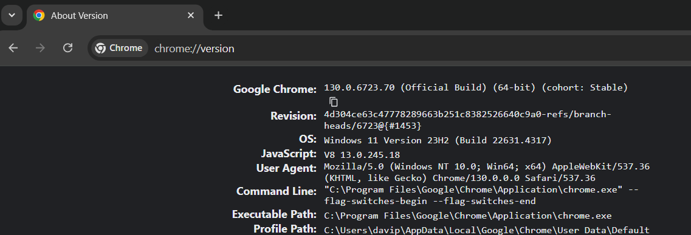

# Youtube Assitant

## Introduction
The goal of this project was to develop a virtual assistant that helps users control an application without touching the mouse and keyboard, using only voice and gestures.
The chosen application was **YouTube** and this project was developed for the [**Multimodal Interaction**](https://www.ua.pt/en/uc/10852) course at the [**University of Aveiro**](https://www.ua.pt/).
The voice modality was developed in Portuguese (Portugal).

## Grade
* Overall - 17
* Voice - 17
* Gestures - 16
* Fusion - 16

### Note
The voice project was valued more than the other two projects, since it was the first modality developed, and the architecture of the assistant was established there.

## Prerequisites
* Xbox One's Kinect 
* MicroPhone
* Python 3.10
* Java 21
* Node js
* Rasa
* Miniconda 3

Execute the following command to install all the python ibraries requirements
```ps
pip install -r requirements.txt
```

### Note
  If you dont have a Xbox One's Kinect you can still run the Voice funcionalities

# How to run
 ## First Step
  Open a `terminal` in this directory and start the `mmiframework` with this commands:
  
  **VOICE Project:**
   ```ps
   cd .\Voice\mmiframeworkV2\; ./start.bat
   ```

  **GESTURES Project:**
   ```ps
   cd .\Gestures\IM\; ./start.bat
   ```

   ## Second Step
   Open another `terminal` in this directory and star the `Fusion Engine` with the following command:

  **VOICE Project:**

   ```ps
   cd .\Voice\FusionEngine\; ./start.bat
   ``` 

  **GESTURES Project:**

   ```ps
   cd .\Gestures\FusionEngine\; ./start.bat
   ``` 

   ## Third Step
  **VOICE Project:**

  Open a `Anacond Prompt (Miniconda3)` and execute this command:

   ```bat
    activate rasa-env &&  cd .\rasa\
  ```

  If it is your `first` time running this project or you made `any change` of a file in the `rasa folder`, before tou start the `rasa server` you need to execute the following command to generate a new `rasa model`
  ```bat
  rasa train
  ```
  Otherwise you can run this command, to start the `rasa server`
  ```
  rasa run --enable-api -m .\models\ --cors "*"
  ```

  **GESTURES Project:**
   ```bat
    cd .\Gestures\GenericGesturesModality-2023\; .\GenericGesturesModality.exe
  ```

  Proper Kinect interaction requires careful positioning of the user's **upper body**. The optimal capture zone spans a **distance between 1.5 and 2 meters from the sensor**. Within the application's GenericGesturesModality interface, users can monitor real-time tracking and gesture recognition. This interface also provides detailed feedback, including the specific gesture detected and its recognition confidence level.If a black window appears within the GenericGesturesModality, check that the Kinect is correctly connected.

  ## Fourth Step
  To start the `web app server` open a `terminal` in this folder and execute the following command

  **VOICE Project:**
  ```ps
   cd .\Voice\WebAppAssistantV2\;   ./start_web_app.bat
  ```

  **GESTURES Project:**	
  ```ps
   cd .\Gestures\WebAppAssistantV2\;   ./start_web_app.bat
  ```

  ## Fifth Step
   To run our `assistant` open a `terminal` in this folder and execute the next command
   ```ps
   cd ./assistant/; ./app.bat
   ```

  ## Last Step
   Ensure your chrome profile is set in the directory `C:\Users\{user}\AppData\Local\Google\Chrome\User Data\Default`. 
   To check this path open the google chrome and write `chrome://version/`, like in the picture below

   

   After that make sure your `google account` is logged in `youtube`.

  ## Optional Step
  In case the last step didn't work, when you run "cd ./assistant/; ./app.bat" you maybe saw a message like this:
  ```ps
    (session not created: DevToolsActivePort file doesn't exist)
    (The process started from chrome location C:\Program Files (x86)\Google\Chrome\Application\chrome.exe is no longer running, so ChromeDriver is assuming that Chrome has crashed.) 
  Stacktrace: 
              ...
              ...
    [19312:12548:1031/232204.442:ERROR:command_buffer_proxy_impl.cc(324)] GPU state invalid after WaitForGetOffsetInRange.
  ```
  Try to run the following command in the terminal:
  ```ps
      taskkill /F /IM chrome.exe /T
  ```
  And then run the assistant again.
  This command will kill all the chrome processes running in the background. We need to do this or the assistant will not work properly.

# Assistant Usage Guide

## Video Search

- "Procura o vídeo [video]"
- "Pesquisa pelo vídeo [video]"

## Video Playback Controls

### Basic Playback

- **Play**: Use commands like "Continuar", "Retome" or "Proceda com o vídeo"
- **Stop**: Say "Parar o vídeo" or "Pausar o vídeo"

### Video Navigation

- **Forward/Backward**: Move forward or backward in the video for a specific period of time
  - Example: "Avançar 10 minutos" or "Recua 30 segundos"
- **Change Playback Speed**: 
  - Increase: "Aumenta a velocidade do vídeo em 1,5"
  - Decrease: "Baixe a velocidade do vídeo em 0,5"
  - Set Specific Speed: "Mude a velocidade do vídeo para 1,75"

### Audio and Subtitles

- **Mute/Unmute**: 
  - "Silenciar o som" or "Desligar som"
  - "Ativar som" or "Ligar som"
- **Subtitles**: 
  - "Ativar legendas"
  - "Desativar legendas"

## Interaction Features

### Channel and Video Management

- **Subscribe/Unsubscribe**: 
  - "Subscrever este canal"
  - "Anular subscrição deste canal"
- **Notifications (Only works after subscription)**: 
  - "Ativa as notificações do canal"
  - "Desativa as notificações"
  - "Quero manter as notificações"

### Share and Save

- **Share Video**: 
  - "Partilha este vídeo com o [Nome]"
- **Save Video to Playlist**: 
  - "Guarda este vídeo na playlist [Nome da Lista]"
- **Comment**: 
  - "Comentar '[Sua mensagem]'"

## Additional Interactions

- **End Conversation**: Use expressions like "Adeus", "Até logo", "Até à próxima"
- **Confirm/Deny**: Respond with "Sim", "Não", "Está bem"
- **Item Selection (The Assistant will ask the user when necessary)**: Choose items by saying "Selecionar o primeiro", "Selecionar o segundo", etc.


## Contributors
**David Palricas** Student ID 108780
**Henrique Coelho** Student ID 108342